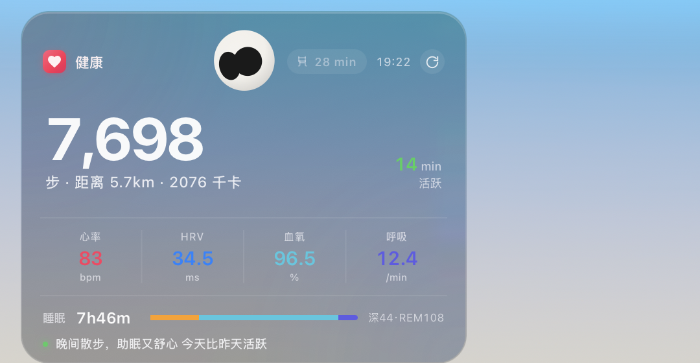

# Google Health Dashboard

[](https://github.com/ARRIIIIIS/google-health-dashboard/releases/tag/v1.1.0) [](./LICENSE) 



在本地运行的个人健康仪表盘，从 Google Health API 获取步数、睡眠、心率、HRV、血氧等数据，所有信息保存在你自己的电脑上。

## 特点

- 🔒 **本地优先** — 数据不上传任何第三方服务器
- 📊 **实时指标** — 步数、睡眠、心率（设备最新采样值）、HRV、血氧、静息心率
- 🟢 **情绪球** — 会呼吸、眨眼、自动换表情的桌面萌宠；久坐时出现愤怒/出错表情
- 🪑 **久坐提醒** — 自动检测久坐并弹窗，点「起来了」立即重置计时
- ⏱️ **每 5 分钟自动刷新**，点刷新图标即刻拉取最新数据
- 🧭 **傻瓜式设置** — 网页向导引导完成 Google 授权
- 🖥️ **双前端** — 浏览器仪表盘 + Übersicht 桌面组件

## 准备条件

1. **穿戴设备** — Fitbit 手环/手表，或任何同步到 Google Health/Health Connect 的设备
2. **macOS** — 桌面组件依赖 [Übersicht](http://tracesof.net/uebersicht/)（macOS 专属），启动脚本使用 `open` 命令；Linux/Windows 未测试
3. **网络环境** — 能访问 Google（国内需科学上网代理）
4. **Python 3 + Node.js**

## 快速开始

```bash
# 1. 下载代码
git clone https://github.com/ARRIIIIIS/google-health-dashboard.git
cd google-health-dashboard

# 2. 复制配置样例
cp config.example.json config.json

# 3. 启动服务
./start.sh

# 4. 打开设置向导
open http://localhost:8911/setup
```

按向导完成 6 步设置即可使用。

## 截图

Übersicht 桌面组件（毛玻璃面板 + 情绪球 + 实时健康指标）：


## 技术栈

- Python 3（数据采集）
- Node.js（本地服务）
- 零 npm 依赖
- 无数据库

## 隐私说明

- 所有数据存储在本地 `data.js` 文件
- Google OAuth 凭据保存在本地 `tokens.json`
- 不会向任何第三方发送你的健康数据

## 更新日志

### v1.1.0
- 🟢 新增情绪球桌面萌宠（呼吸、眨眼、自动换表情，久坐时变愤怒/出错）
- 💓 心率改为设备最新实时采样值（非静息均值）
- 🪑 久坐提醒支持点击「起来了」立即重置计时
- ⏱️ 刷新频率从 10 分钟改为 5 分钟；点刷新图标即刻拉取
- 🧊 毛玻璃磨砂面板，文字偏白提亮

### v1.0.0
- 初始发布：步数 / 睡眠 / 心率 / HRV / 血氧 / 呼吸
- 浏览器仪表盘 + Übersicht 桌面组件双前端
- 网页向导式 Google OAuth 授权

## License

MIT
