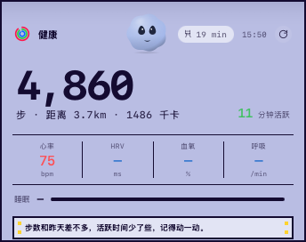
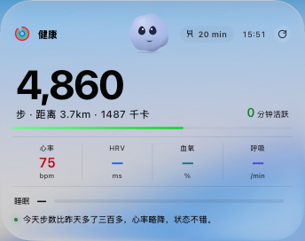
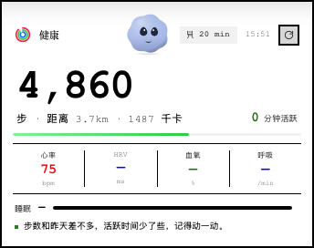
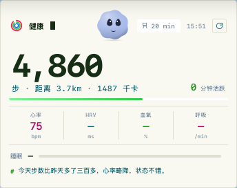

# Health Dashboard (Tauri)

macOS 桌面健康小组件：从 Google Health API 拉取步数、心率、睡眠等数据，常驻屏幕角落。基于 **Tauri 2 + React 18**，透明无边框、不进 Dock、不抢焦点。


## 主题

四套可切换风格，菜单栏 → **主题** 一键切换（窗口圆角随风格自动联动；实底硬边风格为 0 圆角，液态玻璃为 36px 圆角）：

<p align="center">
  
  
  
  
</p>

| 主题 | 说明 |
| --- | --- |
| **液态玻璃** Liquid Glass | Apple 系统毛玻璃，blur(54px)，跟随系统深浅色 |
| **像素动漫风** Pixel Anime | NES 实底 + 2px 硬边 + 硬边像素阴影 + RPG 对话框提示 |
| **网页粗野主义** Brutalist Web | 纯色底 + 1px 硬边 + 硬边投影 + 衬线标题 + 零圆角 |
| **开发者终端** Developer Terminal | 纸白/终端黑 + 荧光绿 + 全等宽 + `#` 注释式提示 + 闪烁光标 |

## 功能

- **步数 / 距离 / 卡路里 / 活跃分钟** 四大指标
- **实时心率 / HRV / 血氧 / 呼吸率**
- **睡眠阶段条**（深睡 / 浅睡 / REM / 清醒）
- **情绪球桌面萌宠**：呼吸、眨眼、自动换表情；**眼睛跟随鼠标光标**（gaze）；久坐变愤怒 / 出错
- **LLM 动态提示**：配置任意 OpenAI 兼容 API（默认 Gemini，国内可换火山方舟等端点），每次数据变化生成 **30 字以内（含标点）** 的个性化提醒，超长自动截断
- **久坐提醒**：从菜单栏图标正下方弹出小窗（SedPopover），点击「起来了」立即重置；勿扰模式不弹
- **菜单栏图标（TrayIcon）菜单**：
  `显示小组件 / 外观(跟随系统·浅色·深色) / 主题(4 种风格) / 语言 / 开机自启动 / 免打扰时静默 / 数据更新 / 久坐提醒 / 立即刷新 / 打开数据目录 / 设置… / 重新启动 / 退出程序`
- **重新启动**：点击经 `relaunch` 真正重启应用（规避 single-instance 接管）
- **位置固定**，对齐 macOS 桌面小组件（重启后保持）
- **刷新间隔** 5 / 15 / 30 分钟预设可选，点击刷新图标即刻拉取
- **三语言界面**（简体中文 / English / 日本語）
- **原生 WidgetKit 组件**（`native-widget/`）：外观 1:1 还原上述风格，可添加到系统桌面小组件

## 安装

从 [Releases](https://github.com/ARRIIIIIS/google-health-dashboard/releases) 下载最新的 `.dmg`，打开后把 `Health Dashboard.app` 拖入「应用程序」即可。

首次启动后通过菜单栏图标 → **设置**，会在浏览器打开引导页。向导采用**分步式**（横向进度条，右上角可切换中 / EN / 日），各步独立保存、互不清空：

1. **Google 健康数据**：填入 OAuth Client ID / Secret → 测试 → **保存并下一步**（凭据保存在 `~/.google-health-mcp/`，不会进仓库）
2. **AI 提示语**：选择服务商 / 填 Base URL / API Key / 模型名（OpenAI 兼容格式）→ 测试 → **保存并完成**
3. 完成页显示成功状态

## 开发

```bash
# 安装前端依赖
npm install

# 开发模式（Vite + Tauri 窗口）
npm run tauri dev

# 生产构建
npm run tauri build   # 产物：src-tauri/target/release/bundle/macos/Health Dashboard.app
```

> **注意 1**：构建依赖 Rust ≥ 1.88（rustup stable）。若本机同时装有 Homebrew 的 rust/cargo，需保证 `~/.cargo/bin` 在 PATH 前部，否则会因 MSRV 报错。
>
> **注意 2**：`npm run tauri build` 的 DMG 打包步骤在这些环境下可能因挂卷限制失败（`.app` 产物始终完好，不影响使用）。可用手动方式打 dmg，见 `native-widget/build_and_install.sh` 或自行用 `hdiutil`。

原生 WidgetKit 组件工程（可选）：

```bash
cd native-widget
./build_and_install.sh   # 生成并安装到本机
```

## 架构

```
health-dashboard-tauri/
├── assets/themes/            # 主题预览截图
├── src/                      # 前端（React 18 + Vite）
│   ├── App.jsx               # 主组件：小组件 UI、多主题调色板、设置面板、情绪球 iframe、gaze 跟随
│   ├── SedPopover.jsx        # 久坐提醒菜单栏弹窗
│   ├── main.jsx              # React 入口
│   ├── styles.css            # 样式与动画
│   ├── i18n.js               # 三语言词条 + t(key)
│   └── emotion-ball/         # 情绪球引擎（内联进 iframe，零 HTTP 服务）
├── src-tauri/                # Tauri 后端（Rust）
│   ├── src/main.rs           # 窗口管理、TrayIcon 菜单、主题/语言切换、采集调度、命令、relaunch
│   ├── resources/
│   │   ├── fetch_standalone.py  # Google Health 采集（写 JSON，每 5 分钟）
│   │   └── setup.html           # 分步式设置引导页（浏览器打开，三语切换）
│   ├── tauri.conf.json       # 窗口配置（透明无边框）
│   ├── capabilities/         # Tauri 2 ACL 权限
│   └── Cargo.toml
├── native-widget/            # 原生 macOS WidgetKit 组件工程（可选）
├── index.html
├── vite.config.js
└── package.json
```

## 数据流

```
Google Health API
    ↓ (Python fetch_standalone.py，每 5 分钟)
data.json (app_data_dir)
    ↓ (Tauri read_data 命令)
React 组件渲染
    ↓
透明置顶桌面窗口
```

- **自动刷新**：Rust 后端定时调用 Python 写 `data.json`
- **手动刷新**：前端 `invoke('refresh_now')` → Rust 调 Python → 写 `data.json`
- **久坐重置**：前端 `invoke('reset_sedentary')` → Rust 直接改 `data.json`
- **前端轮询**：每 5 秒 `invoke('read_data')` 读 `data.json`，数据变化即重渲染
- **点击即刻响应**：窗口强制显示归零状态，不等后端采集

## 已知限制 / 贡献须知

- 打包后需要目标机器有 Python 3 环境（采集脚本依赖）
- Google Health 首次使用需通过浏览器引导页完成 OAuth 授权
- 窗口透明 + 置顶效果针对 macOS 优化，其他平台玻璃感会退化
- **构建坑（贡献者必读）**：在 zh / ja 菜单分支里，独立的 2 字中文串（`重启` / `退出` / `外观` / `浅色` / `深色`）会被 rustc / LLVM 在编译时从二进制丢弃，导致空标签菜单项。菜单标签一律用 3 字以上（如 `重新启动` / `退出程序` / `外观设置` / `浅色模式` / `深色模式`）。
- **i18n 坑**：`data-i18n` 用 `textContent` 赋值会覆盖嵌套子元素（如 `(可选)` 内嵌 span、`summary` 的箭头 span），必须拆成兄弟 span 或用 `data-i18n-html`。
- **LLM 提示语**：system prompt 要求 30 字以内（含标点），并在返回处加硬截断兜底。
- bundle id 为 `com.arrhealth.healthdashboard`（出现于 `main.rs`、Info.plist），开源可改为通用反向域名，不强制。
- 受限环境（如沙箱）下 `npm run tauri build` 的 DMG 打包步骤可能因挂卷限制失败，但 `.app` 产物完好，不影响使用与部署。

## License

MIT © [ARRIIIIIS](https://github.com/ARRIIIIIS)
